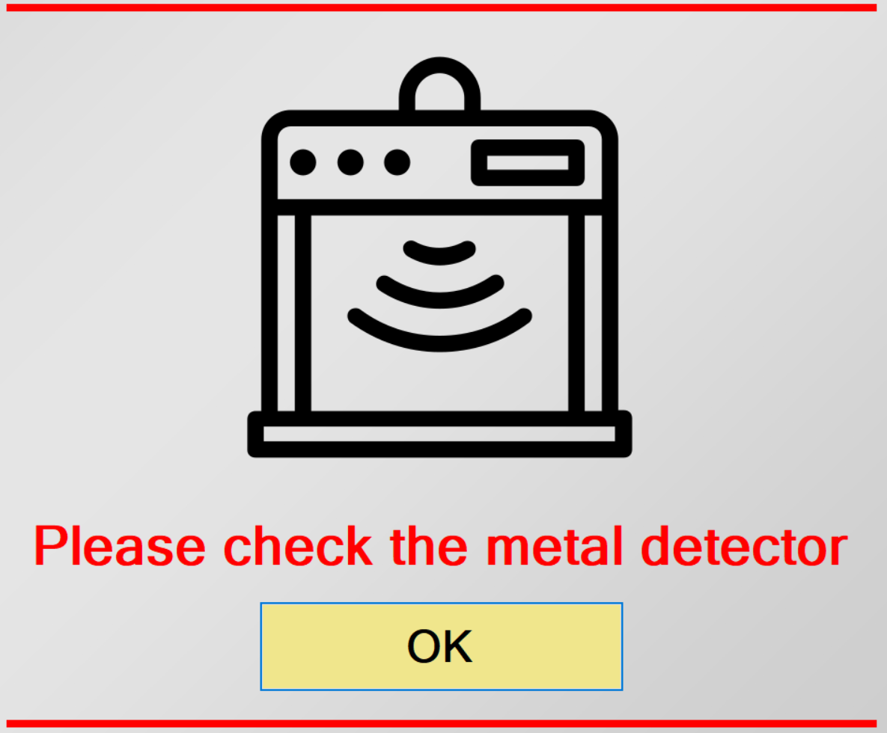

# Metal detector reminder

  
  
A very simple application that runs in full-screen mode. 
My task was to create a reminder for the operators to check the metal detector every certain period. To achieve this, I copied the exe file of my application to the PC, and I set the system scheduler to run the application at every full hour.
